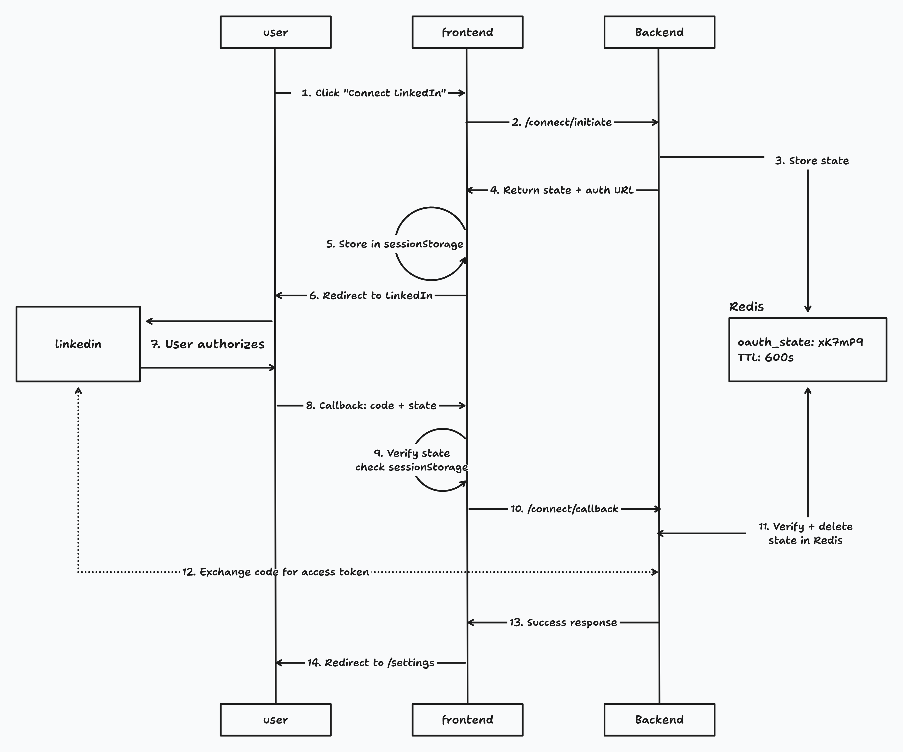

# LinkedIn OAuth 2.0 Flow Implementation

## Overview

OAuth 2.0 authorization code flow for LinkedIn integration with CSRF protection via Redis-backed state tokens.

### What is OAuth 2.0?

OAuth 2.0 is an authorization framework that allows third-party applications to access user data without exposing passwords. The **authorization code flow** is the most secure OAuth 2.0 flow for web applications:

1. User is redirected to the provider (LinkedIn)
2. User authorizes the application
3. Provider redirects back with an authorization code
4. Application exchanges code for access tokens server-side

### CSRF Protection

OAuth flows are vulnerable to **Cross-Site Request Forgery (CSRF)** attacks without proper protection. The **state parameter** prevents these attacks by ensuring the callback originated from a legitimate authorization request.

## Architecture Diagram



## Step-by-Step Flow

### 1. User Initiates Connection (`linkedin-connect-button.tsx`)

User clicks "Connect LinkedIn" button. Frontend calls `/api/linkedin/connect/initiate` to start OAuth flow.

### 2. Backend Generates State Token (`router.py:43`, `oauth.py:15-20`)

Backend generates cryptographically secure random token and stores in Redis with 10-minute TTL for CSRF protection.

```python
state = secrets.token_urlsafe(32)
redis.setex(f"oauth_state:{state}", 600, "1")
```

### 3. Return Authorization URL (`oauth.py:34-44`)

Backend constructs LinkedIn authorization URL with state parameter and returns to frontend.

```
https://www.linkedin.com/oauth/v2/authorization?client_id=...&state={token}&redirect_uri=...
```

### 4. Frontend Stores State & Redirects (`linkedin-connect-button.tsx`)

Frontend stores state in sessionStorage (for later verification), then redirects user to LinkedIn authorization page.

```typescript
sessionStorage.setItem("linkedin_oauth_state", data.state);
window.location.href = data.authorization_url;
```

### 5. User Authorizes on LinkedIn

User clicks "Allow" on LinkedIn's consent screen, granting application access to their profile.

### 6. LinkedIn Redirects Back

LinkedIn redirects user back to callback URL with authorization code and state parameter.

```
http://localhost:5173/linkedin/callback?code=ABC123&state=xK7mP9...
```

### 7. Frontend Verifies State - First Check (`callback/page.tsx`)

Frontend checks if state from URL matches stored sessionStorage value. Prevents CSRF attacks where attacker controls callback URL.

```typescript
const storedState = sessionStorage.getItem("linkedin_oauth_state");
if (state !== storedState) {
  handleError("Invalid state parameter");
}
```

### 8. Backend Verifies State - Second Check (`router.py:61`, `oauth.py:23-31`)

Backend checks if state exists in Redis and deletes it (one-time use). Second line of defense against replay attacks.

```python
exists = redis.exists(f"oauth_state:{state}")
if exists:
    redis.delete(f"oauth_state:{state}")  # One-time use!
    return True
```

### 9. Exchange Code for Token (`oauth.py:47-68`, `service.py:29-55`)

Backend exchanges authorization code for access token from LinkedIn, then stores in database.

### 10. Success & Redirect (`callback/page.tsx`)

Frontend cleans up sessionStorage and redirects user to settings page showing LinkedIn connected.

## Redis Implementation

### Key Pattern

```
oauth_state:{token} → "1" (TTL: 600s)
```

### Operations

- **Set:** `redis.setex(f"oauth_state:{state}", 600, "1")` → `oauth.py:19`
- **Verify & Delete:** `redis.exists(key)` + `redis.delete(key)` → `oauth.py:27-29`
- **Cleanup:** Automatic via Redis TTL

## Related Documentation

- **Redis setup:** `backend/README.md` (Redis Setup section)
- **Environment config:** `backend/.env.example`
- **Code implementation:**
  - Redis client: `backend/app/redis.py`
  - OAuth utilities: `backend/app/social/linkedin/oauth.py`
  - API endpoints: `backend/app/social/linkedin/router.py`
  - LinkedIn service: `backend/app/social/linkedin/service.py`
  - Frontend button: `frontend/src/features/linkedin/linkedin-connect-button.tsx`
  - Frontend callback: `frontend/src/routes/linkedin/callback/page.tsx`
