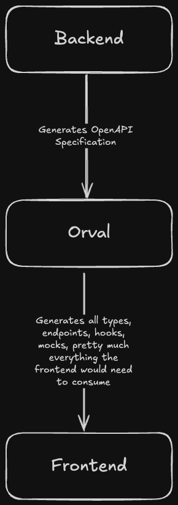

We use [Orval](https://orval.dev/) to generate TypeScript API clients from our OpenAPI specification.



## Why Orval?

1. **Type Safety**: Auto-generates TypeScript types directly from the backend's OpenAPI schema, ensuring frontend and backend stay in sync.
2. **Reduced Boilerplate**: No need to manually write fetch calls, request/response types, or API URLs.
3. **Single Source of Truth**: The OpenAPI spec (generated from Elysia (@elysiajs/openapi)) drives both backend validation and frontend types.

## Current Approach: React Query with Axios

We use Orval's **react-query** client output mode, which generates React Query hooks (`useQuery` and `useMutation`) that use Axios under the hood.

Example generated code:

```ts
export const useRegisterUserApiRegisterPost = <
  TError = AxiosError<HTTPValidationError>,
  TContext = unknown
>(
  options?: {
    mutation?: UseMutationOptions<...>;
    axios?: AxiosRequestConfig;
  },
  queryClient?: QueryClient
): UseMutationResult<...> => {
  const mutationOptions = getRegisterUserApiRegisterPostMutationOptions(options);
  return useMutation({ ...mutationOptions, queryClient });
};
```

### Usage in Components

The generated hooks can be used directly in React components:

```tsx
import { useRegisterUserApiRegisterPost } from '@/api/authentication/authentication';

function RegisterForm() {
  const registerMutation = useRegisterUserApiRegisterPost({
    mutation: {
      onSuccess: () => {
        navigate('/login');
      }
    }
  });

  // In form submit handler:
  const handleSubmit = (value) => {
    registerMutation.mutate({
      data: { email: value.email, password: value.password }
    });
  };

  return (
    <>
      {registerMutation.isPending && <span>Loading...</span>}
      {registerMutation.isError && (
        <span>{getErrorMessage(registerMutation.error)}</span>
      )}
    </>
  );
}
```

## Configuration

The Orval configuration is in `frontend/orval.config.ts`:

```ts
import { defineConfig } from 'orval';

export default defineConfig({
  'super-impress': {
    input: './openapi.json',
    output: {
      httpClient: 'axios',
      target: './src/api/superimpress.ts',
      mode: 'tags-split',
      client: 'react-query',
      override: {
        mutator: {
          path: 'src/api/axios.ts',
          name: 'customInstance'
        }
      }
    },
    hooks: {
      afterAllFilesWrite: {
        command: 'prettier --write ./src/api/**',
        injectGeneratedDirsAndFiles: false
      }
    }
  },
  'super-impress-zod': {
    input: './openapi.json',
    output: {
      target: './src/api',
      mode: 'tags-split',
      client: 'zod',
      fileExtension: '.zod.ts'
    },
    hooks: {
      afterAllFilesWrite: {
        command: 'prettier --write ./src/api/**',
        injectGeneratedDirsAndFiles: false
      }
    }
  }
});
```

## Generated Files Location

Generated API clients live in `src/api/` and are organized by domain:

- `src/api/<domain>/<domain>.ts` - React Query hooks
- `src/api/<domain>/<domain>.zod.ts` - Zod schemas
- `src/api/superimpress.schemas.ts` - Shared types

These files are auto-generated and should **not be edited manually**.
